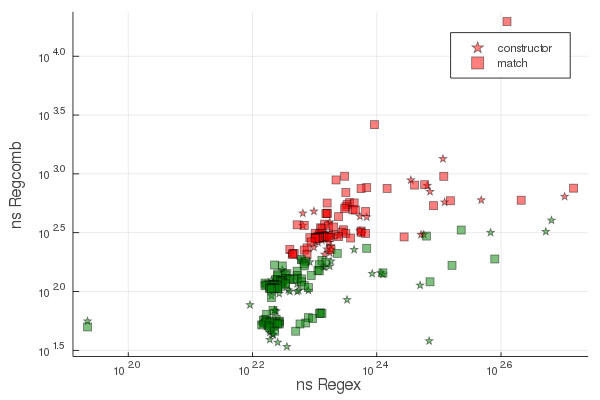
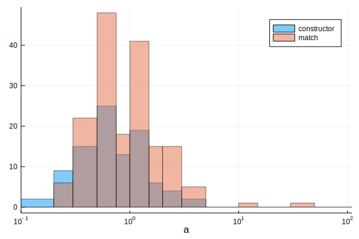

# Compliance with the PCRE test set
!!! note 
    PCRE features supported by `@re_str` 
    - ✓ sequences, alternations (`|`), repetitions (`*`,`+`,`{n}`, `{min,}`, `{min,max}`), optional matches (`?`)
    - ✓ escaped characters and generic character types
    - ✓ character ranges (`[]`)
    - ✓ non-capturing groups
    - ✓ capturing groups, backreferences, subroutines (all by index, relative index and name)
    - ✓ simple assertions (`\A`, `\z`, `\Z`, `\b`, `\B`, `^`, `$`)
    - ✓ lookaheads and lookbehinds
    - ✓ atomic groups
    - ✓ lazy repetitions
    - ✓ conditional expressions
    - ✓ internal and pattern options setting
    - ✓ comments
!!! warning 
    PCRE functionality that is currently not supported:
    - ✕ capture groups in lookbehinds.
    - ✕ ACCEPT, SKIP, COMMIT, THEN, PRUNE, \K
```@setup session
using CombinedParsers
using CombinedParsers.Regexp
```
CombinedParsers.jl is tested and benchmarked against the PCRE C library testset.
The PCRE test output is downloaded from [the PCRE source repository](https://github.com/rurban/pcre/blob/master/testdata/testoutput1), parsed with [a `CombinedParser`](https://github.com/gkappler/CombinedParsers.jl/blob/master/test/pcretest-parser.jl), to run tests benchmarks on `Base.Regex` and `CombinedParsers.Regexp.Regcomb`.
## Test Overview
3025 successful tests on 961 patterns
(See [list of compliant patterns](pcre-compliance-succeeded.md)).

41 failed tests on 27 patterns
(See [list of failed patterns](pcre-compliance-failed.md)).
### Performance Overview:
CombinedParsers is a very young package that will be optimized further, 
but already `@re_str` pure Julia regular expression parsing is competitive with `@r_str` with the PCRE C backend which has arrived at a widely optimized codebase after decades of improvements.

Benchmark timings for regular expression construction and matching comparing `Regex` (x axis) and `Regcomb` (y axis), both on a log10 scale:





Points represent PCRE an individual benchmark. 
PCRE benchmarks have a range between 82ns to 518ns.
CombinedParsers benchmarks have a ~20-times larger range between 33ns to 140μs.
### Benchmark ratios histogram:



The equal are histograms of log10-ratios of `time_Regcomb/time_Regex` shows that `CombinedParser` implementation is competitive, with speeds up to 10x faster in best cases and only rarely 100x slower in worst cases.
Worst cases are investigated for improving [in this IJulia notebook](https://github.com/gkappler/CombinedParsers.jl/blob/master/benchmark/benchmarks.ipynb).

## Unsupported
251 unsupported patterns were omitted for the following reasons:

- `ACCEPT` failed on 16 patterns.
- `COMMIT` failed on 35 patterns.
- `PRUNE` failed on 18 patterns.
- `SKIP` failed on 29 patterns.
- `THEN` failed on 50 patterns.
- `\K` failed on 13 patterns.
- `checking for pattern recursion` failed on 5 patterns.
- `options aftertext` failed on 12 patterns.
- `options g` failed on 5 patterns.
- `options g,aftertext` failed on 7 patterns.
- `options g,dupnames` failed on 5 patterns.
- `options gm` failed on 2 patterns.
- `options imsx,mark` failed on 2 patterns.
- `options mark` failed on 38 patterns.
- `options mark,no_start_optimize` failed on 1 patterns.
- `options x,mark` failed on 13 patterns.
